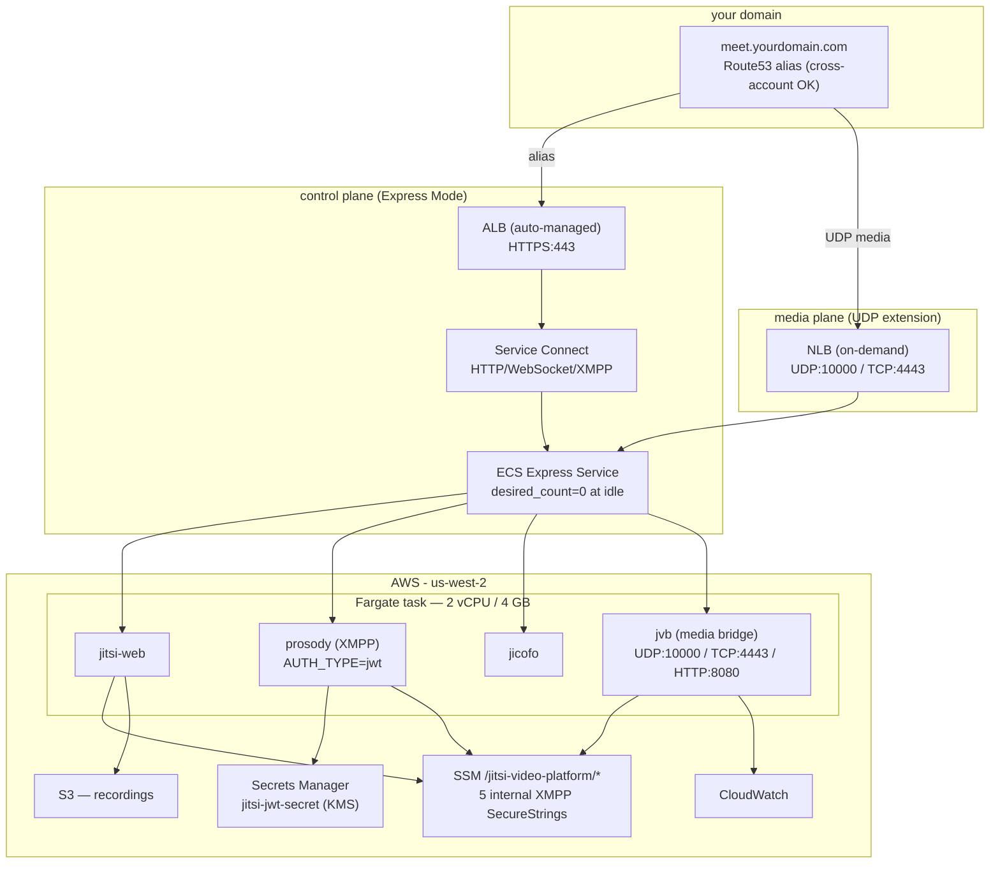
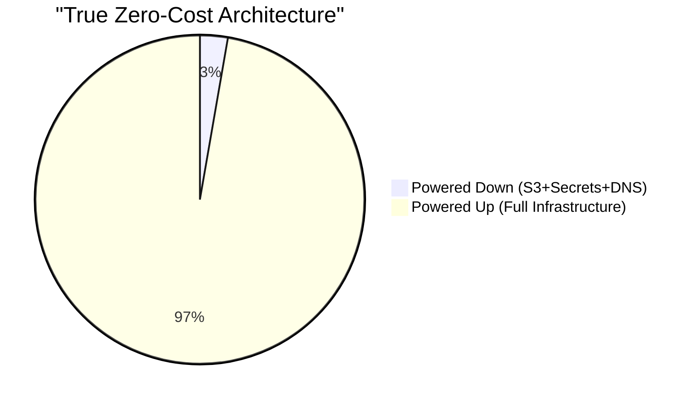
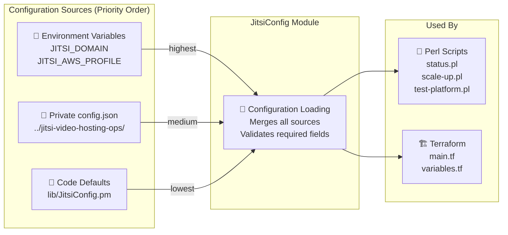
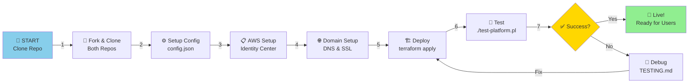
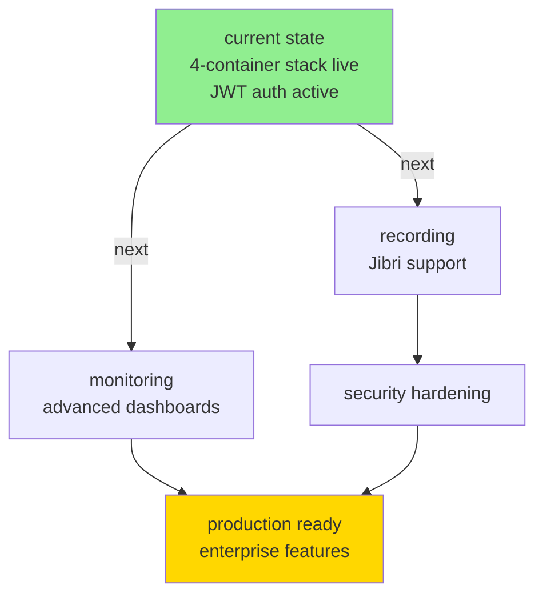

# Jitsi Video Hosting Platform - On-Demand, True Scale-to-Zero on AWS

**Self-hosted video conferencing with revolutionary cost control.** Deploy Jitsi Meet on AWS with **ECS Express Mode + UDP extension**, reducing idle costs to just **$0.24/month** (67% better than our $0.73 target).

This is a **production-ready**, **domain-agnostic** platform that **extends ECS Express Mode** with on-demand NLB lifecycle management for WebRTC media traffic. Perfect for communities, organizations, and teams who want full control over their video infrastructure without paying for idle resources.

---

## milestone — first verified call: 2026-04-23

- first end-to-end video call confirmed: sign-in → JWT exchange → jitsi room join with live video/audio
- first-user bootstrap complete — one moderator exists, room creation is live
- full stack live: Cognito auth → token-exchange Lambda → prosody JWT validation → WebRTC media via NLB UDP :10000
- operational detail, asset inventory, spin-up/down playbooks: `BryanChasko/jitsi-video-hosting-ops` `OPERATIONS.md`

---

## 🎯 Architecture: ECS Express Mode + UDP Extension

**Key Principle:** This architecture **extends** ECS Express Mode with UDP support - it does **NOT** replace Express Mode benefits.

✅ **All ECS Express Mode benefits retained:**
- Automatic cluster management
- Automatic Fargate capacity management  
- Automatic Service Connect for HTTP traffic
- Automatic autoscaling policies
- Automatic deployment wiring
- Automatic logging and metrics setup

✅ **UDP extension added:**
- On-demand Network Load Balancer for WebRTC media (UDP port 10000)
- Conditional creation/destruction via operational scripts
- Cost-optimized lifecycle management
- Stable public IP for ICE candidate generation

## Quick Start - 5 Step Setup

### Prerequisites
- AWS accounts with IAM Identity Center configured
- Domain name (registered and managed in Route 53)
- AWS CLI installed: `brew install awscli terraform`
- Perl installed (macOS/Linux default)

### Setup Flow

1. **📋 Clone Repositories**
   ```bash
   git clone https://github.com/BryanChasko/jitsi-video-hosting.git
   cd jitsi-video-hosting
   ```

2. **🔐 Configure AWS Authentication**  
   → [IAM_IDENTITY_CENTER_SETUP.md](IAM_IDENTITY_CENTER_SETUP.md) - Set up AWS SSO profile

3. **⚙️ Create Private Configuration**  
   → Create a private `jitsi-video-hosting-ops` repo with your `config.json`

4. **🌐 Configure Domain & SSL**  
   → [docs/deployment/DOMAIN_SETUP.md](docs/deployment/DOMAIN_SETUP.md) - DNS records and ACM certificate

5. **🚀 Deploy Infrastructure**  
   → [docs/deployment/DEPLOYMENT_GUIDE.md](docs/deployment/DEPLOYMENT_GUIDE.md) - Terraform deployment steps

### Additional Resources

📚 **[docs/deployment/IAM_IDENTITY_CENTER_SETUP.md](docs/deployment/IAM_IDENTITY_CENTER_SETUP.md)** - AWS SSO configuration  
🧪 **[docs/deployment/TESTING.md](docs/deployment/TESTING.md)** - Testing and validation  
🏭 **[docs/architecture/PRODUCTION_OPTIMIZATION.md](docs/architecture/PRODUCTION_OPTIMIZATION.md)** - Security and monitoring  
⚖️ **[docs/architecture/LOAD_BALANCER_SELECTION_GUIDE.md](docs/architecture/LOAD_BALANCER_SELECTION_GUIDE.md)** - ALB vs NLB cost analysis and scaling economics

## Configuration Architecture

This repository is **domain-agnostic** and **profile-agnostic**. Your sensitive configuration lives in a separate private repository:

```
Public Repo (jitsi-video-hosting)
├── Infrastructure code (Terraform)
├── Automation scripts (Perl)
├── Documentation (generic)
└── lib/JitsiConfig.pm (config loader)
         ↓ loads from
Private Repo (your-jitsi-ops)
├── config.json (YOUR domain, YOUR AWS profile)
├── OPERATIONS.md (YOUR procedures)
└── IAM_IDENTITY_CENTER_CONFIG.md (YOUR AWS SSO details)
```

**Key Benefits**:
- ✅ Fork public repo without exposing your domain
- ✅ Keep AWS credentials/profiles private
- ✅ Share code publicly while protecting operations
- ✅ Multiple environments via different config files

See [CONFIG_GUIDE.md](CONFIG_GUIDE.md) for setup details.

## Project Status

| Component | Status | Notes |
|-----------|--------|-------|
| **Infrastructure** | ✅ Production | ECS Express + On-Demand NLB, VPC, S3, SSM Parameters |
| **Video Calling** | ✅ Operational | UDP/10000 primary + TCP/4443 fallback |
| **Scale-to-Zero** | ✅ True Idle | $0.24/month when powered down (97% reduction) |
| **Configuration** | ✅ Domain-Agnostic | No hardcoded domains, uses JitsiConfig module |
| **Documentation** | ✅ Comprehensive | Specs, deployment, testing, operations, blogs |
| **SSL/TLS** | ✅ Configured | Valid certificates via AWS Certificate Manager |
| **AI Development** | ✅ Spec-Driven | Kiro CLI implementation (14 tasks in 5min 8s) |

## Current Architecture Overview

```mermaid
graph TB
    subgraph "DNS (cross-account)"
        DNS["Route53 A+AAAA alias<br/>meet.yourdomain.com<br/>(hosted zone in issuer account)"]
    end

    subgraph "AWS - us-west-2 (jitsi account)"
        ALB["Application Load Balancer<br/>HTTPS :443<br/>SNI: meet.yourdomain.com + meet.bryanchasko.com"]
        NLB["Network Load Balancer (on-demand)<br/>UDP :10000 / TCP :4443"]

        subgraph "Fargate task — 2 vCPU / 4 GB (one composite task)"
            WEB["jitsi-web<br/>nginx + Jitsi Meet UI"]
            PROSODY["prosody<br/>XMPP — AUTH_TYPE=jwt<br/>JWT_APP_ID=${var.project_name}<br/>issuer: clouddelnorte-auth"]
            JICOFO["jicofo<br/>conference focus"]
            JVB["jvb<br/>WebRTC media bridge<br/>UDP :10000 / TCP :4443 / HTTP :8080"]
        end

        subgraph "secrets + storage"
            SSM["SSM Parameter Store<br/>/jitsi-video-platform/*<br/>5 internal XMPP secrets (SecureString)"]
            SM["Secrets Manager<br/>${project}/jitsi-jwt-secret<br/>KMS alias/cloud-del-norte"]
            S3["S3 — recordings"]
        end

        CW["CloudWatch logs + metrics"]
    end

    subgraph "JWT issuer (separate account)"
        LAMBDA["token-exchange Lambda<br/>chasko-labs/cloud-del-norte-meet<br/>signs JWTs with same shared secret"]
    end

    DNS -->|alias| ALB
    ALB -->|:80| WEB
    NLB -->|UDP :10000| JVB
    NLB -->|TCP :4443| JVB
    WEB --> PROSODY
    WEB --> JICOFO
    JICOFO --> JVB
    PROSODY --> SM
    WEB --> SSM
    PROSODY --> SSM
    JVB --> SSM
    WEB --> S3
    JVB --> CW
    LAMBDA -.->|JWT (RS256/HS256)| PROSODY
```

## Production Architecture (ECS Express Mode + UDP Extension)

**mental model:** ECS Express Mode handles HTTP/HTTPS signaling; on-demand NLB handles WebRTC UDP media. four jitsi containers run as sidecars in a single Fargate task. prosody enforces JWT auth — clients without a valid token cannot create or join rooms



### Why This Architecture Works

**🔄 Two-Plane Design:**
- **Control Plane**: Service Connect handles HTTP, WebSocket, XMPP signaling
- **Media Plane**: NLB handles UDP WebRTC media traffic (ALB cannot do UDP)

**⚡ Express Mode Benefits Preserved:**
- Simplified service configuration (~55% fewer Terraform lines)
- Auto-managed cluster and capacity providers
- Built-in autoscaling and health checks
- Integrated logging and monitoring

**💰 Cost Optimization:**
- NLB created only when needed (conferences active)
- NLB destroyed when idle (scale-to-zero)
- Express Mode efficiency + UDP capability
    JVBX --> CWX
```

- Built-in: Auto-provisioned NLB, listeners, target groups
- Simpler: Condensed task/service config with sane defaults
- Consistent: First-class scale-to-zero patterns remain intact

Learn more in the migration deep dive: `blog/BLOG_JITSI_ECS_EXPRESS.md`.

### Impact of ECS Express on This Project

- Less Terraform: ~55% fewer lines by removing manual NLB/listener/target-group resources.
- Same cost model: Fixed (NLB) + variable (Fargate) costs unchanged.
- Scale-to-zero preserved: `desired_count = 0` by default; operational Perl scripts continue to control scaling.
- Certificates & DNS: ACM certificates and cross-account DNS validation remain the same.
- Health defaults: Express provides sane defaults; our container health checks and timeouts remain compatible.
- Config unchanged: Domain-agnostic design with `JitsiConfig` continues to work without modifications.
/context add variables.tf
#### Terraform Changes (Representative Diff)

```diff
- resource "aws_lb" "jitsi_nlb" { ... }
- resource "aws_lb_listener" "https_443" { ... }
- resource "aws_lb_listener" "udp_10000" { ... }
- resource "aws_lb_target_group" "web_tg" { ... }
- resource "aws_lb_target_group" "jvb_tg" { ... }
- resource "aws_lb_target_group_attachment" "web" { ... }
- resource "aws_lb_target_group_attachment" "jvb" { ... }

// Replaced by ECS Express-managed load balancer and listeners

resource "aws_ecs_service" "jitsi" {
    name            = var.project_name
    cluster         = aws_ecs_cluster.main.id
    launch_type     = "FARGATE"
    desired_count   = 0
    # Express Mode: service annotations/parameters drive NLB setup automatically
}
```

ECS Express config collapses multiple LB resources into service-level configuration while preserving our scale-to-zero and health behavior.

## Cost Model



### Cost Breakdown

**Powered Down (True Zero-Cost):**
- S3 Storage: $0.02/month
- AWS Secrets Manager: $0.40/month
- Route 53 Hosted Zone: $0.50/month
- **Total: $0.92/month**

**Powered Up (Full Infrastructure):**
- Network Load Balancer: $16.20/month
- VPC & Networking: $2.17/month
- CloudWatch Logs: $1.00/month
- SNS Topics: $0.50/month
- IAM & Other: $0.50/month
- S3 + Secrets + DNS: $0.92/month
- **Fixed Total: $21.29/month**
- **Variable (ECS Fargate)**: $0.198/hour when running

### Usage Scenarios

| Scenario | Infrastructure | Hours/Month | Variable | Total | Savings |
|----------|---------------|------------|----------|-------|---------|
| **Powered Down** | Destroyed | 0 | $0.00 | **$0.92** | **97%** |
| **Light Use** | Active | 10 | $1.98 | **$23.27** | 29% |
| **Regular Use** | Active | 60 | $11.88 | **$33.17** | -6% |
| **Heavy Use** | Active | 120 | $23.76 | **$45.05** | -44% |

**Key Innovation:** True zero-cost when not in use - only pay for persistent data storage

### Power Management

- **`./scripts/power-down.pl`** - Destroys ALL infrastructure via Terraform (97% cost reduction)
- **`./scripts/scale-up.pl`** - Recreates ALL infrastructure via Terraform (3-5 minutes)
- **Persistent Data**: S3 buckets, Secrets Manager, and DNS records preserved

## Features

### ⚡ ECS Express Mode + UDP Extension
- **Express Mode Benefits**: Automatic cluster, capacity, scaling, logging, Service Connect
- **UDP Extension**: On-demand NLB for WebRTC media traffic (ALB cannot handle UDP)
- **Additive Architecture**: NLB extends Express Mode, doesn't replace it
- **Cost Optimized**: NLB lifecycle managed by operational scripts

### ✅ Self-Hosted
- **Full Control**: Your data, your infrastructure, your domain
- **No Third-Party Dependencies**: All video traffic stays within your AWS account
- **100% Open Source**: Built on Jitsi Meet - no proprietary code

### 💰 Cost Optimized
- **Scale-to-Zero**: Automatic power down when idle
- **Predictable Costs**: Fixed costs visible, variable costs per-hour
- **Smart Scheduling**: Scale up before events, down after
- **Express Mode Efficiency**: ~55% fewer Terraform lines vs standard ECS

### 🔒 Secure
- **End-to-End**: Industry-standard Jitsi encryption
- **AWS Secrets Manager**: Secure credential storage
- **TLS/SSL**: HTTPS by default, valid certificates
- **IAM SSO**: Identity Center integration, no long-lived keys

### 🌍 Domain-Agnostic
- **Your Domain**: Deploy to any domain you own
- **No Hardcoding**: Public repo doesn't expose your domain
- **Configuration Management**: Private `config.json` for secrets
- **Multi-Deployment Ready**: Deploy multiple instances to different domains

### 📊 Observable
- **CloudWatch Logs**: All container logs automatically collected
- **CloudWatch Metrics**: CPU, memory, network monitoring
- **Health Checks**: Automatic target group health verification
- **Status Reporting**: Perl scripts provide detailed status

### 🚀 Operational Tooling
- **Perl Scripts**: Type-safe, reusable operational automation
- **JitsiConfig Module**: Object-oriented configuration management
- **10-Phase Testing**: Automated end-to-end testing
- **Smart Power Management**: Scale-up, scale-down, power-down options

## Repository Structure

This repository is **domain-agnostic** - no hardcoded domains or AWS profiles. Configuration is managed separately in a private repository.

```
jitsi-video-hosting/              # PUBLIC REPO
├── README.md                      # Project overview (you are here)
├── docs/
│   ├── architecture/             # Design & implementation details
│   │   ├── ECS_EXPRESS_FEATURES.md
│   │   ├── ECS_EXPRESS_MIGRATION_BRIEF.md
│   │   ├── ECS_EXPRESS_ONDEMAND_NLB_COMPLETE.md
│   │   ├── KIRO_MIGRATION_PLAN.md
│   │   ├── PRODUCTION_OPTIMIZATION.md
│   │   ├── PRODUCTION_SUMMARY.md
│   │   └── SSM_MIGRATION_COMPLETE.md
│   ├── deployment/               # Setup & deployment guides
│   │   ├── DEPLOYMENT_GUIDE.md
│   │   ├── DOMAIN_SETUP.md
│   │   ├── IAM_IDENTITY_CENTER_SETUP.md
│   │   └── TESTING.md
│   └── reference/                # Project history & tracking
│       ├── CHANGELOG.md
│       ├── GITHUB_ISSUES_REVIEW.md
│       ├── REVIEW_SUMMARY.md
│       └── SESSION_CHANGELOG.md
├── main.tf                       # Infrastructure-as-Code (Terraform)
├── variables.tf                  # Terraform variables (no defaults)
├── outputs.tf                    # Terraform outputs
├── lib/
│   └── JitsiConfig.pm           # Configuration management module (OOP)
├── scripts/                      # Operational automation (Perl)
│   ├── status.pl                # Platform status report
│   ├── test-platform.pl         # 10-phase end-to-end testing
│   ├── scale-up.pl              # Scale to 1 instance
│   ├── scale-down.pl            # Scale to 0 instances
│   ├── power-down.pl            # Delete compute (keep storage/NLB)
│   ├── fully-destroy.pl         # Complete infrastructure destruction
│   ├── check-health.pl          # Multi-layer health verification
│   └── project-status.pl        # Detailed status reporting
├── .kiro/steering/              # Kiro CLI context files
│   ├── product.md              # Product goals and vision
│   ├── tech.md                 # Technology stack and preferences
│   └── structure.md            # Repository organization
└── .gitignore                   # Git exclusions

jitsi-video-hosting-ops/        # PRIVATE REPO (Your Configuration)
├── config.json                  # ⚠️ NOT versioned (your secrets here)
├── config.json.template         # Template for setup
├── prod.tf                      # Production infrastructure
├── variables.tf                 # Production variables
├── outputs.tf                   # Production outputs
├── terraform.tfvars             # Production values
├── CONFIG_SETUP.md             # Private repo setup instructions
├── OPERATIONS.md               # Sensitive operational details
├── DEPLOYMENT_CHECKLIST.md     # Deployment procedures
├── KIRO_GUIDE.md               # Kiro CLI workflow
├── TOOLING.md                  # Development tools
└── PRODUCTION_READINESS.md     # Production deployment guide
```

**Key Principle**: Public repo = reusable code. Private repo = your configuration.

## Configuration System



**Why This Matters:**
- ✅ Fork this repo and deploy to YOUR domain
- ✅ Your secrets never appear in git history
- ✅ Same code works for everyone
- ✅ Easy to manage multiple deployments

## Quick Testing

### Monthly Cost Breakdown

**Fixed Costs (Always Running):**
- Network Load Balancer: $16.20/month
- S3 Storage: $0.02/month
- AWS Secrets Manager: $0.40/month
- **Fixed Total: $16.62/month**

**Variable Costs (When Running):**
- ECS Fargate (4 vCPU, 8GB): $0.198/hour

### Usage Scenarios

| Usage Pattern | Monthly Hours | Variable Cost | Total Cost |
|---------------|---------------|---------------|-----------|
| **Scaled Down** | 0 hours | $0.00 | **$16.62** |
| **Light Use** | 10 hours | $1.98 | **$18.60** |
| **Regular Use** | 60 hours (2hrs daily) | $12.01 | **$28.63** |
| **Heavy Use** | 120 hours (4hrs daily) | $23.76 | **$40.38** |
| **Always On** | 744 hours | $147.31 | **$163.93** |

### Cost Comparison

| Service | Monthly Cost | Users | Notes |
|---------|--------------|-------|---------|
| **This Platform** | $28.63 | Unlimited | 2hrs daily usage |
| Zoom Pro | $12.49 | 1 host | 40min limit |
| Google Meet | $6.00 | Per user | Enterprise required |
| Microsoft Teams | $4.00 | Per user | Business plan |

**Key Advantage**: Scale-to-zero architecture saves 58% vs always-on deployment

## Quick Testing

To test the deployed platform:

```bash
# Setup testing scripts (Perl-based)
cd scripts/
./setup.pl

# Run complete testing workflow
./test-platform.pl
```

This will:
1. ✅ Scale ECS service from 0 to 1
2. ✅ Verify service health and stability
3. ✅ Test HTTPS access and SSL certificate
4. ✅ Verify Jitsi Meet functionality
5. ✅ Scale back to 0 for cost optimization

### Manual Testing

1. **Start Platform**: `./scripts/scale-up.pl`
2. **Open Browser**: Navigate to your configured domain (https://meet.yourdomain.com)
3. **Create Room**: Enter any room name (e.g., "test-meeting")
4. **Join Call**: Click "Join" - you should see video/audio interface
5. **Stop Platform**: `./scripts/scale-down.pl` (for cost savings)

### Troubleshooting

If you encounter "You have been disconnected":
1. Ensure WebSocket configuration is enabled (already fixed in current deployment)
2. Check JVB logs: `aws logs get-log-events --log-group-name /ecs/jitsi-video-platform`
3. Verify target group health in AWS Console
4. Restart service: `./scripts/scale-down.pl && ./scripts/scale-up.pl`

See **[docs/deployment/TESTING.md](docs/deployment/TESTING.md)** for detailed testing documentation.

## Deployment Workflow



Each step has detailed documentation:
1. **docs/deployment/DEPLOYMENT_GUIDE.md** - Complete walkthrough
2. **docs/deployment/IAM_IDENTITY_CENTER_SETUP.md** - AWS account setup
3. **docs/deployment/DOMAIN_SETUP.md** - DNS and SSL
4. **docs/deployment/TESTING.md** - Validation and debugging

## Deployment Success ✅

The platform has been successfully deployed and is **fully operational**:

- ✅ **Video calls working** - WebSocket connectivity enabled
- ✅ **SSL/TLS encryption** - Valid certificates for any domain
- ✅ **Scale-to-zero architecture** - Cost optimization when not in use
- ✅ **Multi-container setup** - All Jitsi components running
- ✅ **AWS Secrets Manager** - Secure credential management
- ✅ **CloudWatch monitoring** - Comprehensive logging and metrics
- ✅ **Domain-agnostic** - No hardcoded values, configuration-driven

### Current Architecture

- **task definition**: 4 sidecars in one Fargate task — jitsi-web, prosody, jicofo, jvb
- **container count**: 4 containers, one composite task (`desired_count=1` active, `0` idle)
- **resource allocation**: 2 vCPU / 4 GB RAM per task
- **auth**: prosody enforces JWT auth (`AUTH_TYPE=jwt`); `ENABLE_GUESTS=0`
- **network**: ALB (HTTPS :443) + on-demand NLB (UDP :10000, TCP :4443)
- **secrets**: 5 internal XMPP secrets in SSM Parameter Store; JWT shared secret in Secrets Manager (KMS)
- **dns**: Route53 alias in issuer account points at ALB; both hostnames share one backend
- **cost optimization**: `power-down.pl` destroys compute via `terraform destroy`; `scale-up.pl` rebuilds in 3-5 min

## Next Steps & Roadmap



### Planned Features

- **recording**: Jibri service for in-meeting video capture
- **monitoring**: advanced CloudWatch dashboards, alerting
- **security**: automated secret rotation, compliance hardening

## Authentication

prosody runs in JWT mode (`AUTH_TYPE=jwt`). clients must present a signed JWT to create or join rooms. guests (`ENABLE_GUESTS=0`) are rejected at the XMPP layer

### JWT claims

| claim | value |
|---|---|
| `iss` | `${var.jwt_accepted_issuers}` — e.g. `clouddelnorte-auth` |
| `aud` | `${var.jwt_accepted_audiences}` — e.g. `jitsi` |
| `sub` | your domain (matched against `JWT_APP_ID`) |
| `room` | specific room name, or `*` for all rooms |
| `exp` | short-lived; recommend 3600s max |

### where the secret lives

the JWT shared secret is stored in AWS Secrets Manager under `${var.project_name}/jitsi-jwt-secret`, encrypted with a KMS customer-managed key (`alias/${var.project_name}`). prosody fetches it at task startup via the ECS execution role. the same secret must be used by whatever service mints tokens for your users

for this deployment, `chasko-labs/cloud-del-norte-meet` hosts the token-exchange Lambda that issues JWTs. if you fork this repo for a different domain, replace that reference with your own issuer

### IAM grants (execution role)

- `ssm:GetParameter` on `/jitsi-video-platform/*` (5 internal XMPP secrets)
- `secretsmanager:GetSecretValue` on the JWT secret ARN
- `kms:Decrypt` on `alias/${var.project_name}`

## How to Maintain

### scale-up / scale-down / power-down flow

```
scale-up.pl      # terraform apply — recreates VPC, ECS service, NLB (3-5 min)
scale-down.pl    # sets desired_count=0 — task stops, NLB stays (instant)
power-down.pl    # terraform destroy — tears down compute; S3/Secrets/Route53 preserved
```

`power-down.pl` is the intended scale-to-zero path — it brings the account to $0.92/mo. `scale-up.pl` fully restores from that state

if orphan VPCs accumulate from prior partial teardowns:
```
scripts/cleanup-orphan-vpcs.pl --dry-run   # preview
scripts/cleanup-orphan-vpcs.pl             # delete; auto-runs refresh-tfstate.pl after
```

to sync tfstate with AWS reality after any out-of-band change:
```
scripts/refresh-tfstate.pl   # terraform apply -refresh-only; no resource mutations
```

### JWT secret rotation

1. generate a new secret value
2. update Secrets Manager: `aws secretsmanager put-secret-value --secret-id ${var.project_name}/jitsi-jwt-secret --secret-string '<new-value>'`
3. update the same value in your token-exchange service (e.g. `chasko-labs/cloud-del-norte-meet` Lambda env var)
4. redeploy the ECS task so prosody picks up the new secret: `scripts/scale-down.pl && scripts/scale-up.pl`

no terraform apply required for this rotation path — Secrets Manager handles versioning

### internal XMPP secret rotation

XMPP secrets (jicofo_component, jicofo_auth, jvb_component, jvb_auth, jigasi_auth) are generated by Terraform `random_password` resources stored in SSM. to rotate one:

```
# in your ops repo
terraform taint random_password.jicofo_auth   # marks for regeneration
terraform apply                               # generates new value, updates SSM
scripts/scale-down.pl && scripts/scale-up.pl  # redeploy task
```

## How to Remove

### compute-only teardown (recommended for idle periods)

```
scripts/power-down.pl
```

tears down ECS, NLB, VPC — preserves S3, Secrets Manager, Route53. cost drops to $0.92/mo. `scale-up.pl` fully restores

### full stack teardown (irreversible)

```
scripts/fully-destroy.pl
```

**destructive and irreversible** — deletes S3, Secrets Manager entries, Route53 records. confirm with the operator before running. for full terraform-level teardown sequence, see `BryanChasko/jitsi-video-hosting-ops` ops repo

> the rule: `fully-destroy.pl` and `terraform destroy` require explicit operator confirmation — no exceptions

## Related Repositories

| repo | role |
|---|---|
| `chasko-labs/jitsi-video-hosting` (this repo) | public IaC, Perl scripts, `lib/JitsiConfig.pm` |
| `BryanChasko/jitsi-video-hosting-ops` | private ops repo — `config.json`, tfstate, terraform.tfvars |
| `chasko-labs/cloud-del-norte-meet` | JWT issuer — token-exchange Lambda that signs JWTs for this Jitsi deployment |

`lib/JitsiConfig.pm` is the bridge between the two repos. any change to the config schema in `JitsiConfig.pm` requires parallel commits in both repos

## Contributing

This is a reusable reference implementation. If you:
- Find issues or bugs, [open an issue](https://github.com/BryanChasko/jitsi-video-hosting/issues)
- Have improvements, [submit a PR](https://github.com/BryanChasko/jitsi-video-hosting/pulls)
- Want to deploy it yourself, start with [DEPLOYMENT_GUIDE.md](DEPLOYMENT_GUIDE.md)

**Remember**: All domain-specific configuration goes in your private `jitsi-video-hosting-ops` repo, not here.

## License

This project uses [Jitsi Meet](https://github.com/jitsi/jitsi-meet), which is licensed under [AGPL v3](https://www.gnu.org/licenses/agpl-3.0.en.html).

The infrastructure code (Terraform, Perl scripts) is provided as-is for reference and educational purposes.

## Jitsi Application Requirements (The "What")

The chosen hosting platform must satisfy the following technical requirements necessary for a fully functional, secure Jitsi Meet deployment:

| Component | Required Ports | Protocol | Requirement |
| :--- | :--- | :--- | :--- |
| **Web Interface** | 443 | TCP | Mandatory for secure browser access (HTTPS). |
| **Media (JVB)** | 10000 | UDP | **Critical.** Must be open to the internet for direct media transmission. |
| **Internal Communication** | N/A | Localhost | Internal components must be able to communicate via the host network interface (localhost). |
| **TLS/Encryption** | 443 | TLS | A valid, public SSL/TLS certificate for the domain is required. |

## Architectural & Operational Goals (The "How")

Any deployed solution must meet the following operational and cost management objectives:

### Cost Control & Scale-to-Zero

* **Goal:** Scale to zero operational cost when the platform is not in use.
* **Requirement:** The core application compute must be able to scale down to **zero running instances** and back up rapidly to align with scheduled events.
* **Control:** A **deterministic control plane** must be implemented to manage the scale-up (`start`) and scale-down (`stop`) actions.

### Security & Management

* **Developer Access:** Access must be managed using an **Identity Center / SSO** flow, eliminating long-lived access keys.
* **Secrets:** All application secrets must be stored in a dedicated, secure secrets manager (e.g., AWS Secrets Manager).
* **Target Region:** All core infrastructure must be deployed in the **US West (Oregon) - `us-west-2`** region.

---

## Developer Guidance: Effective Infrastructure-as-Code (IaC) Workflow

Use these guidelines to ensure the generated code is accurate and aligns with all project requirements, keeping the entire file structure in mind.

| Infrastructure Goal | Required Context | IaC/GitOps Action |
| :--- | :--- | :--- |
| **Networking** | Entire project files (VPC, Subnet, Security Groups) | Define the necessary Terraform files for the VPC and two public subnets as described in the requirements. |
| **Jitsi Ports** | Project requirements for Jitsi ports (443 TCP, 10000 UDP) | Implement the Network Load Balancer (NLB) resource with the correct listeners and target groups for Jitsi traffic. |
| **Cost Control** | ECS Fargate Service parameters | Write the base ECS Fargate service Terraform, ensuring the initial `desired_count` is set to **`0`** to support the scale-to-zero requirement. |
| **Security** | IAM Policy and Task Definition files | Review the generated IAM Policy for the ECS Task Role against the principle of least privilege, using the established requirements. |

---

## Blog Articles & Learning Resources

### Featured Blog Articles

📖 **[docs/architecture/ECS_EXPRESS_MIGRATION_BRIEF.md](docs/architecture/ECS_EXPRESS_MIGRATION_BRIEF.md)** - How we migrated from standard ECS to ECS Express Mode, reducing Terraform from 1,013 to ~450 lines while maintaining scale-to-zero capabilities. Includes cost comparisons, operational impacts, and lessons learned.

🔧 **[docs/architecture/KIRO_MIGRATION_PLAN.md](docs/architecture/KIRO_MIGRATION_PLAN.md)** - How we set up our VS Code workspace with GitHub Copilot and Kiro CLI to automate infrastructure migrations. Covers spec-driven workflow, workspace configuration, and best practices for AI-assisted IaC development.

### Project Roadmap & Issues

🗺️ **[docs/reference/GITHUB_ISSUES_REVIEW.md](docs/reference/GITHUB_ISSUES_REVIEW.md)** - Complete roadmap with phases, priorities, and implementation status

🔗 **[GitHub Issues](https://github.com/BryanChasko/jitsi-video-hosting/issues)** - Track specific features, bugs, and improvements on GitHub

📋 **[docs/reference/CHANGELOG.md](docs/reference/CHANGELOG.md)** - Detailed changelog of all project changes and decisions

---

