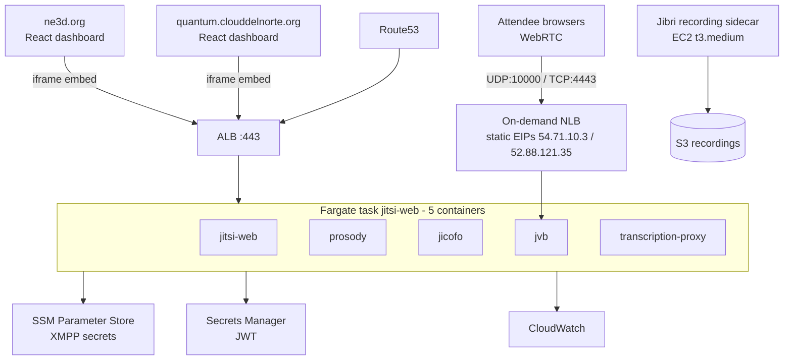
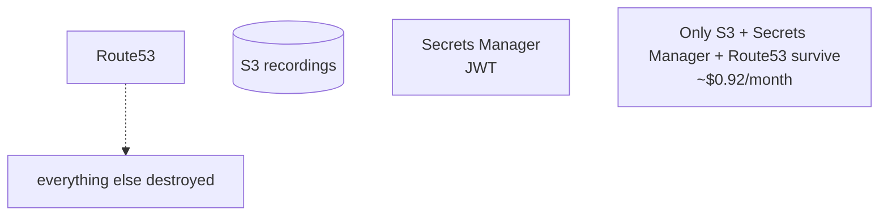

# The Month I Left the Lights On: A Jitsi Cost-and-Usage Retrospective (August 2026)

## Introduction

This is the third post in the Jitsi-on-ECS-Express-Mode series. The first two were forward-looking: here is the architecture, here is the on-demand scale-to-zero design, here is the idle target of well under a dollar a month. Projection pieces. Confident ones.

This one is different. This one has receipts.

In August 2026 the platform hosted two community meetups on the shared backend — one on ne3d.org (the New England 3D graphics community) and one on quantum.clouddelnorte.org (a quantum-computing session behind the Cloud del Norte dashboard). The design says that between those two events the platform should not exist. `power-down.pl` runs `terraform destroy`. Only S3, Secrets Manager, and Route53 survive, at roughly $0.92/month. Two front doors, one backend, zero idle waste.

That is the design. The August Cost Explorer numbers tell a different story, and the gap between the two is the whole point of this post.

I wrote a blog about hating always-on containers. About my grandma walking through the house turning off lights nobody was using. Then I built infrastructure that can turn itself off in a two-minute Perl script, and I left it running for most of a month anyway. So this is not a victory lap. This is me catching my own infrastructure leaving the lights on, with the meter reading printed out on the table.

**Project Repository**: [jitsi-video-hosting](https://github.com/BryanChasko/jitsi-video-hosting) — domain-agnostic, reusable architecture.

## The Architecture, As It Runs Today

Region `us-west-2`, account `170473530355`. One shared ECS cluster (`jitsi-cluster`) serves both meetups through two separate front doors. There is no per-site backend — that is deliberate, and it is the thing that keeps this affordable when it is run correctly.

- **quantum.clouddelnorte.org** — a React dashboard that iframe-embeds `meet.clouddelnorte.org`
- **ne3d.org** — the same embed pattern, with its own separate admin API

Both point at the same signaling and media plane. Two planes make it work:

1. **Control / signaling** on ECS Express Mode — `jitsi-web` behind an ALB on 443
2. **Media** — JVB behind an on-demand Network Load Balancer, UDP:10000 as primary with TCP:4443 as fallback. The NLB is pinned to static Elastic IPs `54.71.10.3` and `52.88.121.35`, and `JVB_ADVERTISE_IPS` matches those exactly. Google STUN is disabled on purpose, because it is blocked in mainland China and we have attendees there — the static public IPs do the ICE job STUN would normally do.

One correction to the earlier post, since it matters for anyone reading the two side by side: the prior blog described a four-container task. The Fargate task `jitsi-web` now runs **five** containers — `jitsi-web`, `prosody`, `jicofo`, `jvb`, and a `transcription-proxy`. Recording (Jibri) runs **separately**, as an EC2-backed ECS service on a `t3.medium`. That EC2 sidecar is a line item in the cost table below, and it is one of the things that quietly ran all month.

### Panel 1 — Running



### Panel 2 — Powered down (the design)



_Caption: this is the state the platform is supposed to return to between meetups. August's bill shows this panel was rarely reached._

## What It Cost: The Gross Numbers

Before the table, one honest disclaimer that I refuse to bury.

**The net billed number for August was approximately $0.** That is not a real cost. It is a credit artifact — a `-$414.66` promotional credit plus a $200 flat-rate subscription absorbing $214.66 of gross usage. If I reported net-zero as "what this platform costs," I would be lying to you and to myself. Credits run out. The gross usage is what the platform consumes, and that is the number that matters when the credit line goes to zero.

So here is the gross usage — what this would have cost on an ordinary bill.

### Jitsi account 170473530355 (us-west-2), gross August 2026

| Component                                 | Usage                    | Cost    |
| ----------------------------------------- | ------------------------ | ------- |
| ECS Fargate vCPU-hours                    | 2061.31 vCPU-Hrs         | $83.44  |
| ECS Fargate GB-hours                      | 4122.62 GB-Hrs           | $18.33  |
| Network Load Balancer (LoadBalancerUsage) | 1444 Hrs                 | $32.49  |
| EC2 Jibri (t3.medium, recording sidecar)  | 639.88 Hrs               | $26.62  |
| VPC Public IPv4 (in-use)                  | 4257.75 Hrs              | $21.29  |
| CloudWatch custom metrics                 | 54.81 metrics            | $13.44  |
| WAF                                       | —                        | $8.00   |
| EBS gp2                                   | 25.81 GB-Month           | $2.58   |
| Secrets Manager                           | 2 secrets                | $0.80   |
| ELB LCU + regional data transfer          | —                        | $0.09   |
| S3                                        | 0.006 GB + ~840 requests | $0.0019 |
| Lambda                                    | —                        | $0.0012 |
| SSM Parameter Store                       | no billed usage          | $0.00   |

### Route53 account 211125425201 (global) — in-scope line items

| Component            | Usage                             | Cost   |
| -------------------- | --------------------------------- | ------ |
| Route53 hosted zones | 6 zones                           | ~$3.00 |
| Route53 DNS queries  | 111,332 public + 45,622 intra-AWS | ~$0.04 |

**Grand total in-scope gross: ~$210.13 USD.**

A note on scope: Amazon Route 53 Domains registrar and domain-renewal fees are excluded from the architecture and budget line items by design — those are a business-registration cost, not an infrastructure cost. In August 2026 that fee was $0 because no domain renewed this month. Stating it once, separately, so the exclusion is deliberate and visible rather than a gap.

## Reading the Meter: The Numbers That Give It Away

Two meetups. Design says the platform exists only while a meetup runs — call that a handful of hours each, plus setup. So the usage numbers should be small. They are not.

**The NLB ran 1444 load-balancer-hours.** August has 744 hours in it. You cannot run a single load balancer for 1444 hours in a 744-hour month. That number is roughly two NLBs running continuously — most likely one that was created for a meetup and never torn down, overlapping with the next spin-up. The on-demand NLB is the one component the whole cost model depends on being ephemeral, and it was the least ephemeral thing in the account.

**Public IPv4 held 4257.75 in-use hours.** Divide by 744 and that is about 5.7 public addresses held continuously, all month. Static EIPs for the NLB, task ENIs, the Jibri instance — all of them sitting there, in-use, billing by the hour, whether a meeting was live or not.

**Jibri ran 639.88 hours.** The recording sidecar — the `t3.medium` that only needs to exist when someone is recording a session — was up for the equivalent of 26 straight days.

None of that is scale-to-zero. The designed idle target is ~$0.92/month. The platform spent August at something much closer to always-on, and the Fargate vCPU-hours ($83.44 alone) confirm the tasks themselves were rarely at `desired_count=0`.

The mechanism was never the problem. The discipline of running it was.

## The Code That Was Supposed to Prevent This

Here is the frustrating part: the tooling is right. It is short, it works, and it does exactly what it claims. I just did not run it enough.

### 1. The on-demand NLB — `modules/jvb-nlb/main.tf`

```hcl
resource "aws_lb" "jvb" {
  name               = "${var.project_name}-jvb-nlb"
  internal           = false
  load_balancer_type = "network"

  # subnet_mapping pins each AZ to a permanent Elastic IP.
  dynamic "subnet_mapping" {
    for_each = var.subnet_eip_mappings
    content {
      subnet_id     = subnet_mapping.value.subnet_id
      allocation_id = subnet_mapping.value.allocation_id
    }
  }

  enable_deletion_protection = false
}

resource "aws_lb_target_group" "jvb_udp" {
  name        = "${var.project_name}-jvb-udp-tg"
  port        = 10000
  protocol    = "UDP"
  vpc_id      = var.vpc_id
  target_type = "ip"

  health_check {
    path     = "/about/health"
    port     = "8080"
    protocol = "HTTP"
  }
}
```

_Caption: the NLB is supposed to exist only while a meetup runs. The static EIPs give JVB a stable public IP for WebRTC ICE without STUN. The `enable_deletion_protection = false` is right there — nothing was stopping the teardown except me not calling it._

### 2. The line that makes UDP video work behind an NLB — `jitsi-video-hosting-ops/terraform/prod.tf`

```hcl
environment = [
  { name = "JVB_PORT",            value = "10000" },
  { name = "JVB_TCP_PORT",        value = "4443" },
  { name = "JVB_ADVERTISE_IPS",   value = "54.71.10.3,52.88.121.35" },
  # Google STUN is blocked in mainland China; rely on JVB_ADVERTISE_IPS
  # (public NLB IP) + TCP/4443 fallback instead.
  { name = "JVB_STUN_SERVERS",    value = "" },
]
```

_Caption: `JVB_ADVERTISE_IPS` matches the NLB's static EIPs exactly, and STUN is intentionally empty. This is the config that lets UDP video traverse an NLB for attendees who cannot reach Google's STUN servers._

### 3. The spin-up and spin-down — `scripts/scale-up.pl` and `scripts/power-down.pl`

```perl
# scale-up.pl — recreate everything, then register NLB targets
chdir("../../jitsi-video-hosting-ops/terraform");
system("terraform apply -auto-approve");
# ...
print "  Before: ~\$0.92/month (S3 + Secrets + Route53 only)\n";
print "  After:  ~\$32.82/month (full infrastructure active)\n";
sleep(30);            # let ECS tasks acquire IPs
system("perl register-nlb-targets.pl");
```

```perl
# power-down.pl — destroy everything except persistent data
chdir("../../jitsi-video-hosting-ops/terraform");
system("terraform destroy -auto-approve");
# ...
print "  Before: ~\$32.82/month (ECS + NLB + VPC + CloudWatch + ...)\n";
print "  After:  ~\$0.92/month (S3 + Secrets Manager + Route53 only)\n";
print "  Savings: ~\$31.90/month (97% reduction)\n";
```

_Caption: spin-down is plain `terraform destroy` wrapped in Perl, and spin-up is `terraform apply` plus target registration. The mechanism worked. The discipline of running `power-down.pl` after each meetup did not._

## A Sidebar: Nova Finding the Nova-Worthy Screenshots

The figures below were not hunted down by hand. There were roughly 1600 screenshots sitting on the mac mini desktop, months of them, and finding the handful that showed a live Jitsi meetup would have taken an afternoon of squinting.

Instead, an Amazon Nova 2 multimodal-embeddings classifier (`amazon.nova-2-multimodal-embeddings-v1:0`) labeled the whole pile against positive anchors like "clouddelnorte meeting" and scored each image by cosine margin over the nearest negative. It surfaced 173 of 210 clouddelnorte positives and 21 of 53 ne3d positives, 155 of them high-confidence at margin > 0.05. The full manifest lives at `tools/screenshot-labeler/jitsi-screenshot-manifest.json`.

There is a pleasing symmetry to it — a Nova model finding the Nova-worthy screenshots of the platform whose bill this post is dissecting. It is also just the right way to do it: embeddings over a directory beat a human scrolling through a screenshot folder every time.

## Figures (to be inserted)

The images live on the mac mini desktop; paths below are the manifest source records, ordered by `jitsi_score`.

- **Figure 1** — quantum.clouddelnorte.org session, highest-scoring frame.
  Source: `/tmp/jitsi-shots/clouddelnorte/Screenshot 2026-04-30 at 16.16.13.png` (jitsi_score 0.6171)
- **Figure 2** — clouddelnorte meeting, second-highest.
  Source: `/tmp/jitsi-shots/clouddelnorte/Screenshot 2026-05-01 at 07.31.07.png` (jitsi_score 0.6162)
- **Figure 3** — ne3d.org August meetup, highest ne3d frame.
  Source: `/tmp/jitsi-shots/ne3d/Screenshot 2026-08-30 at 16.07.15.png` (jitsi_score 0.5479)
- **Figure 4** — ne3d.org August meetup, second ne3d frame.
  Source: `/tmp/jitsi-shots/ne3d/Screenshot 2026-08-30 at 14.39.48.png` (jitsi_score 0.5366)

_(Figure contents to be inserted from the manifest paths above — not reproduced here.)_

## What I Am Fixing

The lesson is not "the architecture was wrong." The architecture is right. On-demand scale-to-zero with an ephemeral NLB and a separate recording sidecar is exactly the shape this workload should have. The gross numbers prove the opposite of a design flaw — they prove the design was never given the chance to work, because the teardown step depended on a human remembering to run a script.

Anything that depends on me remembering to turn off the lights will eventually be left on. My grandma did not remember every light — she built the habit until it was automatic, and where it was not automatic, the lights got left on. Same failure mode, forty years apart, now billed by the vCPU-hour.

So the corrective is operational, not architectural:

- **Automate the teardown** so it cannot be forgotten — a scheduled `power-down.pl` on an idle-detection trigger, or a hard end-of-meetup hook that runs `terraform destroy` without waiting on my memory.
- **Alarm on the tells** — a CloudWatch alarm on NLB `LoadBalancerUsage` hours and on Public IPv4 in-use hours would have caught the 1444-hour and 4257-hour overruns days into the month instead of at the retrospective.
- **Report gross, not net, in the monthly review** — the credit masked $210 of usage this month. When I read net-zero and feel fine, that is the moment the discipline slips. The number I watch has to be the gross one.

The tooling to turn the lights off is a two-minute Perl script that already exists and already works. The fix is making sure it runs whether I remember it or not.

_Cost figures sourced from AWS Cost Explorer, account 170473530355 (us-west-2) and account 211125425201 (Route53, global), August 2026. Gross usage reported; net billed was absorbed by promotional credit and flat-rate subscription._
